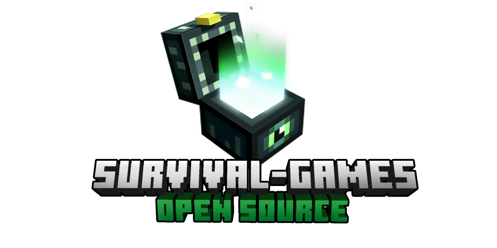

[![Contributors][contributors-shield]][contributors-url]
[![Forks][forks-shield]][forks-url]
[![Stargazers][stars-shield]][stars-url]
[![Issues][issues-shield]][issues-url]
[![Apache License][license-shield]][license-url]

 

  

<h3 align="center">SurvivalGames</h3>

  

    The best SurvivalGames project at the market
     
     
    <a href="https://github.com/iiProCraft/SurvivalGames/wiki">Wiki</a>
    •
    <a href="https://github.com/iiProCraft/SurvivalGames/issues/new?assignees=&labels=Requires+Testing&template=bug_report.yml">Report issue</a>
    •
    <a href="https://github.com/iiProCraft/SurvivalGames/issues/new?assignees=&labels=Enhancement&template=feature_request.yml">Request feature</a>
     
     
    <a>This project will be available soon...</a>
  

<!-- MARKDOWN LINKS & IMAGES -->
<!-- https://www.markdownguide.org/basic-syntax/#reference-style-links -->
[contributors-shield]: https://img.shields.io/github/contributors/iiProCraft/SurvivalGames.svg?style=for-the-badge
[contributors-url]: https://github.com/iiProCraft/SurvivalGames/graphs/contributors
[forks-shield]: https://img.shields.io/github/forks/iiProCraft/SurvivalGames.svg?style=for-the-badge
[forks-url]: https://github.com/iiProCraft/SurvivalGames/network/members
[stars-shield]: https://img.shields.io/github/stars/iiProCraft/SurvivalGames.svg?style=for-the-badge
[stars-url]: https://github.com/iiProCraft/SurvivalGames/stargazers
[issues-shield]: https://img.shields.io/github/issues/iiProCraft/SurvivalGames.svg?style=for-the-badge
[issues-url]: https://github.com/iiProCraft/SurvivalGames/issues
[license-shield]: https://img.shields.io/github/license/iiProCraft/SurvivalGames.svg?style=for-the-badge
[license-url]: https://github.com/iiProCraft/SurvivalGames/blob/master/LICENSE
[product-screenshot]: images/logo.png