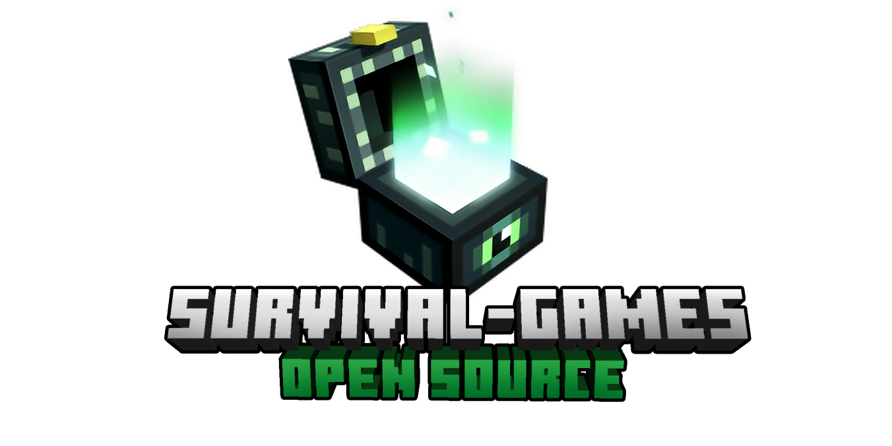
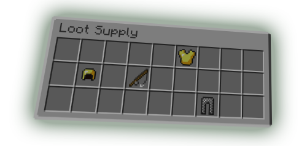

[![Contributors][contributors-shield]][contributors-url]
[![Forks][forks-shield]][forks-url]
[![Stargazers][stars-shield]][stars-url]
[![Issues][issues-shield]][issues-url]
[![MIT License][license-shield]][license-url]

 

  

<h3 align="center">dev.iiprocraft.sg.api.SurvivalGames</h3>

  

    The best dev.iiprocraft.sg.api.SurvivalGames project at the market
     
     
    <a href="https://github.com/iiProCraft/dev.iiprocraft.sg.api.SurvivalGames/wiki">Wiki</a>
    •
    <a href="https://github.com/iiProCraft/dev.iiprocraft.sg.api.SurvivalGames/issues/new?assignees=&labels=Requires+Testing&template=bug_report.yml">Report issue</a>
    •
    <a href="https://github.com/iiProCraft/dev.iiprocraft.sg.api.SurvivalGames/issues/new?assignees=&labels=Enhancement&template=feature_request.yml">Request feature</a>
     
  

## About This Project

For years ago, a lot of players want a dev.iiprocraft.sg.api.SurvivalGames system like HiveMC's one and since HiveMC closed at April 15, 2021, there is not another place to play their games. So I decided to recreate their game-modes for free and let other developers modify it as they want, that's why it's open source.

## Features

Here's some of our features:
* Support for MySQL, MongoDB, JSON and SQLite storage providers
* Redis support for bungee mode
* Single and Multiple map system (Multiple means you can `/vote` for map like HiveMC)
* SlimeWorldManager support for better map loading and restore system
* Very lightweight, so it won't affect your server performance a lot
* Fully configurable, so if you are not a developer you can edit it via configurations

If you have any idea please [Suggest your idea](https://github.com/iiProCraft/dev.iiprocraft.sg.api.SurvivalGames/issues/new?assignees=&labels=Enhancement&template=feature_request.yml) here.

## Arena System

We have multiple ways to run the plugin:

### Bungee Mode (aka Single server for every game)

If you want to run this plugin with singleton server, there are two ways to run the plugin:

* auto-balance enabled: the plugin will run multiple dev.iiprocraft.sg.api.arena processes with 1 minecraft instance. (Redis is required to be enabled)
* auto-balance disabled: the plugin will run one dev.iiprocraft.sg.api.arena for each 1 minecraft instance.

### Multi-dev.iiprocraft.sg.api.arena Mode

The best solution if you have a small minecraft server with ~100 players average, it will run all dev.iiprocraft.sg.api.SurvivalGames processes such as lobby and arenas with 1 minecraft instance.

### Shared mode

A Great solution for very small servers like ~40 players average if you want to run multiple mini-games with 1 minecraft instance.

## Chest System

  

We offer a very advanced & designable loot chest system. Items are based in chances and tiers for every chest type which they are all configurable as you want!

****

# Credits
Special thanks to:
* Primt: Logo designing
* Invvk: Some help with code organizing and modules ordering
* SlawPing: Some help with the idea of the mini-game and coding stuff
* Mqzn: Working on the api & base code
* DirectPlan: Working on the api & base code
* MrMicky: FastBoard as Scoreboard Library

Also thanks to everyone who kept this project alive and up-to-date :heart:

# License

This project is licensed under [MIT License](https://opensource.org/licenses/MIT), you can read it at [LICENSE](https://github.com/iiProCraft/dev.iiprocraft.sg.api.SurvivalGames/blob/master/LICENSE) file

<!-- MARKDOWN LINKS & IMAGES -->
<!-- https://www.markdownguide.org/basic-syntax/#reference-style-links -->
<!-- MARKDOWN LINKS & IMAGES -->
<!-- https://www.markdownguide.org/basic-syntax/#reference-style-links -->
[contributors-shield]: https://img.shields.io/github/contributors/iiProCraft/SurvivalGames.svg?style=for-the-badge
[contributors-url]: https://github.com/iiProCraft/SurvivalGames/graphs/contributors
[forks-shield]: https://img.shields.io/github/forks/iiProCraft/SurvivalGames.svg?style=for-the-badge
[forks-url]: https://github.com/iiProCraft/SurvivalGames/network/members
[stars-shield]: https://img.shields.io/github/stars/iiProCraft/SurvivalGames.svg?style=for-the-badge
[stars-url]: https://github.com/iiProCraft/SurvivalGames/stargazers
[issues-shield]: https://img.shields.io/github/issues/iiProCraft/SurvivalGames.svg?style=for-the-badge
[issues-url]: https://github.com/iiProCraft/SurvivalGames/issues
[license-shield]: https://img.shields.io/github/license/iiProCraft/SurvivalGames.svg?style=for-the-badge
[license-url]: https://github.com/iiProCraft/SurvivalGames/blob/master/LICENSE
[product-screenshot]: .github/images/logo.png
